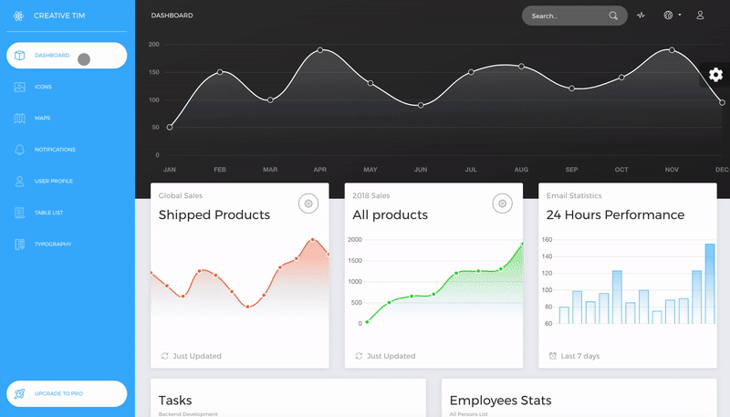

# [React Design](https://demos.creative-tim.com/now-ui-dashboard-react/#/dashboard) [](https://twitter.com/intent/tweet?url=https%3A%2F%2Fdemos.creative-tim.com%2Fnow-ui-dashboard-react%2F%23%2Fdashboard&text=Now%20UI%20Dashboard%20React%20by%20Creative%20Tim%20%7C%20Free%20React%20Admin%20Template&original_referer=http%3A%2F%2Flocalhost%3A3000%2Fdashboard&via=creativetim&hashtags=react%2Cbootstrap)


## File Structure

Within the download you'll find the following directories and files:

```
Now UI Dashboard React
├── CHANGELOG.md
├── Documentation
│   └── tutorial-components.html
├── LICENSE.md
├── README.md
├── package.json
├── public
│   ├── apple-icon.png
│   ├── favicon.ico
│   ├── index.html
│   └── manifest.json
└── src
    ├── assets
    │   ├── css
    │   │   └── demo.css
    │   ├── fonts
    │   │   └── ...
    │   ├── img
    │   │   ├── flags
    │   │   │   └── ...
    │   │   └── ...
    │   └── sass
    │       ├── now-ui-dashboard
    │       │   ├── mixins
    │       │   │   └── ...
    │       │   ├── plugins
    │       │   │   └── ...
    │       │   └── ...
    │       └── now-ui-dashboard.scss
    ├── components
    │   ├── Card
    │   │   └── Card.jsx
    │   ├── Footer
    │   │   └── Footer.jsx
    │   ├── FormInputs
    │   │   └── FormInputs.jsx
    │   ├── Header
    │   │   └── Header.jsx
    │   ├── Sidebar
    │   │   └── Sidebar.jsx
    │   └── Task
    │       └── Task.jsx
    ├── containers
    │   └── App
    │       └── App.jsx
    ├── elements
    │   ├── CardElements
    │   │   ├── CardLegend.jsx
    │   │   ├── CardStatistics.jsx
    │   │   ├── CardStats.jsx
    │   │   └── UserCardAuthor.jsx
    │   ├── CustomButton
    │   │   └── CustomButton.jsx
    │   ├── CustomCheckbox
    │   │   └── CustomCheckbox.jsx
    │   └── CustomRadio
    │       └── CustomRadio.jsx
    ├── index.js
    ├── routes
    │   └── app.jsx
    ├── variables
    │   ├── charts.jsx
    │   ├── general.jsx
    │   └── icons.jsx
    └── views
        ├── Dashboard
        │   └── Dashboard.jsx
        ├── Icons
        │   └── Icons.jsx
        ├── Maps
        │   └── Maps.jsx
        ├── Notifications
        │   ├── NotificationSystem
        │   │   └── NotificationSystem.jsx
        │   └── Notifications.jsx
        ├── Table
        │   └── Tables.jsx
        ├── Typography
        │   └── Typography.jsx
        └── User
            └── User.jsx
```

## Browser Support

At present, we officially aim to support the last two versions of the following browsers:

    


